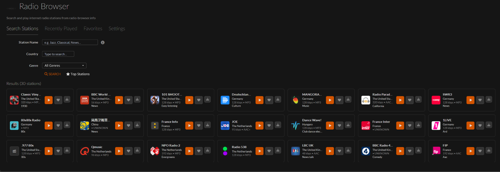
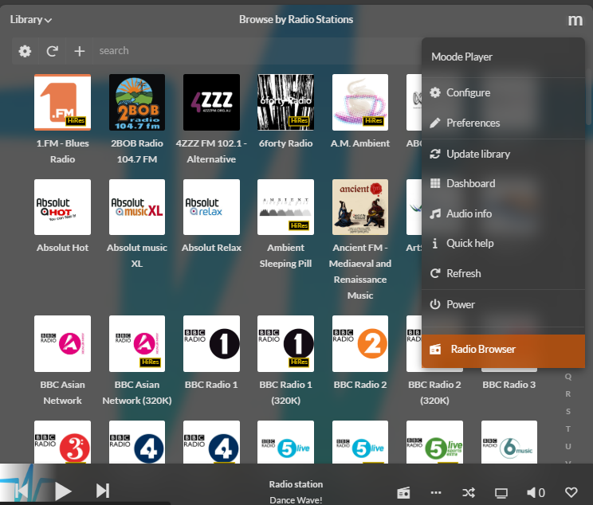
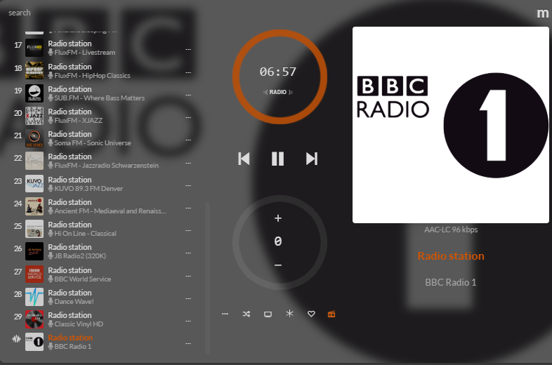
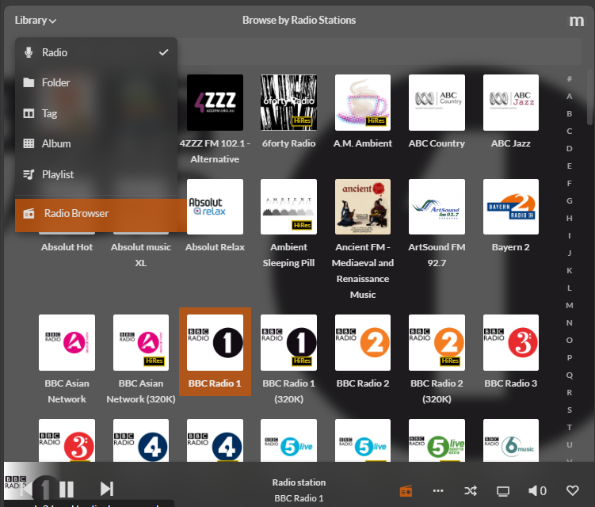
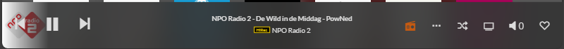
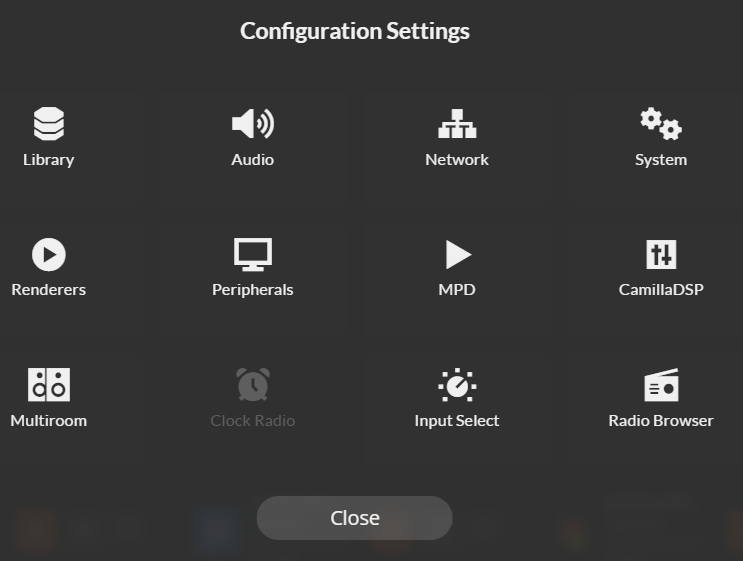
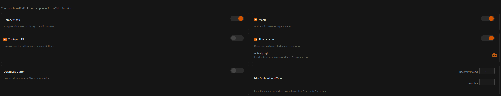
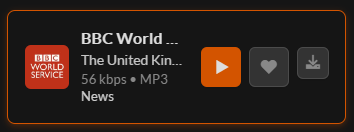

# Radio Browser 4.0

<p align="center">
  
  
  
  
  
</p>

<p align="center">
  <strong>Browse and play 30,000+ internet radio stations directly from your moOde Audio player</strong>
</p>

<p align="center">
  
</p>

---

## Installation

Login via SSH on your moOde Audio Player (ShellInABox or terminal) and execute one of the following commands:

**curl:**

```bash
curl -sL https://raw.githubusercontent.com/rubatron/RadioBrowser/HEAD/radio-browser/install.sh | sudo bash
```

**wget:**

```bash
wget -qO- https://raw.githubusercontent.com/rubatron/RadioBrowser/HEAD/radio-browser/install.sh | sudo bash
```

---

## What's New in 4.0

### Easier Installation

Refer to the [Installation](#installation) section above. One command, fully automatic.

### UI Overhaul

- Radio Browser 4.0 now holds multiple dedicated sections
- Moved **Recently Played** to a dedicated section
- Moved **Search Stations** and results to a dedicated section
- Moved **Settings** to a dedicated section
- Added **Recently Played** and **Favorites** sections

### Radio-Browser.info API

- Improved API to utilize the **load balancing / CDN** feature instead of a single dedicated URL
- Added a button in the API settings section to view the [API status page](https://api.radio-browser.info/net)

### Troubleshooting

- Updated troubleshooting section with more functions
- **Debug Mode** toggle
- **Uninstall / Reinstall / Repair** buttons
- **Repair Thumbnail Cache**
- Improved logging

### General Fixes

- Improved installation method
- Logo thumbnail passthrough to moOde's Playlist if available
- Removed Custom API functionality (hidden, pending redesign)

---

## moOde Menu Integration

Flexible menu integration which can be configured within the Radio Browser extension. All icons act as shortcuts to the extension.

### M Menu

<p align="center">
  
</p>

### CoverArt View

<p align="center">
  
</p>

### Library Menu

<p align="center">
  
</p>

### Player Bar

<p align="center">
  
</p>

Radio Browser Activity Indicator — shows a Radio Browser logo in the moOde Player Bar. Acts as a shortcut to the extension.

### Configure Tile

<p align="center">
  
</p>

Once clicked, navigates directly to the Radio Browser Settings section.

---

## Visibility Options

<p align="center">
  
</p>

The toggles allow you to show and hide the Radio Browser menu items integrated with the moOde UI:

| Toggle | Description |
|--------|-------------|
| **Library Menu** | Hidden / Visible toggle |
| **M Menu** | Hidden / Visible toggle |
| **Configure Tile** | Hidden / Visible toggle |
| **Playbar Icon** | Hidden / Visible toggle |
| **Activity Light** | When colored, the activity indicator is active. Click the icon to toggle. |
| **Download Button** | Show / hide the download button on station cards |
| **Max Station Card View** | Limit the number of cards shown for Favorites and Recently Played |

---

## Station Cards

<p align="center">
  
</p>

Each station card shows the station logo, name, country, bitrate, codec, and genre. Action buttons:

- **Play** — start streaming immediately via MPD
- **Favorite** — save the station to moOde's Radio library
- **Download** — download the `.m3u` stream file to your local device

---

## Requirements

| Requirement | Version | Notes |
|-------------|---------|-------|
| moOde Audio | 9.0+ | Required |
| PHP | 8.2+ | With curl, gd, json extensions |

---

## Uninstall

```bash
cd /var/www/extensions/installed/radio-browser
sudo bash install.sh
```

Select the **Uninstall** option. This removes all extension files and restores moOde's original configuration. Your moOde Radio favorites are preserved.

---

## License

This project is licensed under the **GPL-3.0-or-later** License.

---

## Credits

- **RubaTron** — Author and maintainer
- **[radio-browser.info](https://www.radio-browser.info)** — Radio station database API
- **[moOde Audio](https://moodeaudio.org)** — Audio player platform

---

<p align="center">
  Made with ❤️ for the moOde community
</p>
